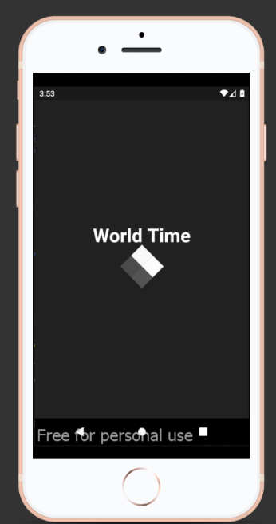
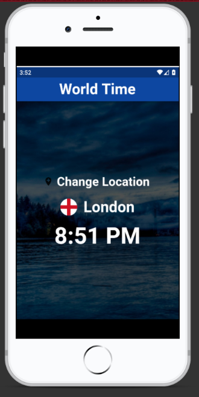
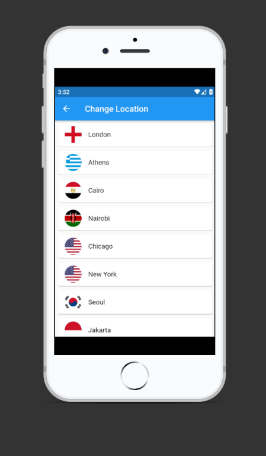

# world_time_app
A world time app developed using Flutter for learning purposes

<h4>World Time Splash screen</h4>
 

<h4>World Time clock/Time screen</h4>
 

<h4>World Time Choose Location screen</h4>
 
